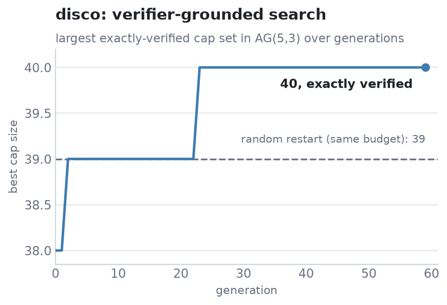

# disco

[](https://github.com/ss1738/disco/actions/workflows/ci.yml)
[](https://pypi.org/project/disco-search/)
[](LICENSE)

**Verifier-grounded evolutionary discovery**, an open, general form of the
FunSearch loop. A pluggable proposer suggests candidates, a **hard verifier**
certifies them, and island-model evolution keeps improving. The core guarantee:
**only verifier-certified candidates ever survive**, so whatever disco returns is
provably valid by construction and its score is real. Pure Python, zero
dependencies.

```python
from disco import Discovery
from disco.problems import CapSet

problem = CapSet(4)                       # cap set in AG(4,3); 81 points
best = Discovery(problem, seed=0).run(80)

print(best.score.value)                   # 20.0  (the proven maximum)
print(problem.is_cap(best.candidate))     # True  (re-verified, exact)
```

## The idea

DeepMind's FunSearch showed that an LLM proposing candidates + an evaluator
scoring them + evolutionary search can discover new results in maths and
algorithms. That harness is closed. disco is a clean, general, open version of
the same loop:

- **Proposer** (pluggable): a mutation operator, a crossover, or an **LLM**
  (`disco.proposers.LLMProposer` is what turns disco into FunSearch).
- **Verifier** (yours): unit tests, an exact combinatorial check, a simulator,
  or any oracle returning `(valid, value)`.
- **Search**: island-model evolution with tournament selection and periodic
  migration for diversity.

Because the verifier gates every candidate, a bad proposal (including a
hallucinated LLM completion) simply fails and is dropped; it costs one
evaluation and can never corrupt the population.

## Benchmark: cap sets

Finding large **cap sets** (subsets of `{0,1,2}^n` with no 3 points on a line) is
a hard open problem in combinatorics and FunSearch's headline example. The
verifier here is exact, so every size is a *provable* cap.

`benchmarks/bench_capset.py`: AG(5,3), 243 points, same evaluation budget for
both:

| Method | Cap size (exactly verified) |
|---|---|
| Random restart (best of many greedy caps) | 39 |
| **disco (evolutionary)** | **40** |



Evolution beats a strong random-restart baseline because the mutation operator
keeps a *heritable core* and only rebuilds the periphery; a fully-greedy rebuild
would erase heritability and match random. On the tractable AG(4,3) instance
disco reaches the proven maximum of **20**. (These are honest numbers from a
mutation operator; the point of the harness is that you plug in a smarter
proposer, an LLM, for harder problems.)

```
python benchmarks/bench_capset.py
python examples/capset_demo.py       # watch a cap set grow, exactly verified
```

## Plug in an LLM (FunSearch mode)

```python
from disco import Discovery
from disco.proposers import LLMProposer

problem.propose = LLMProposer(
    complete=my_llm, # (prompt: str) -> str, any model
    render=lambda parents: f"Improve on these:\n{parents}\nReturn a better one.",
    parse=my_parser, # (text: str) -> candidate
)
best = Discovery(problem, seed=0).run(200)
```

The engine handles selection, islands, migration, and, crucially,
**verification**, so the LLM can be creative without the search ever accepting
something invalid.

## Define your own problem

Implement three methods:

```python
class MyProblem:
    def seed(self, rng):            ...   # one valid starting candidate
    def propose(self, parents, rng): ...  # a new candidate from 1-2 parents
    def verify(self, candidate):    ...   # -> disco.Score(valid, value)
```

Then `Discovery(MyProblem()).run(generations)`.

## API

- **`Discovery(problem, islands=4, population=24, tournament=3, migrate_every=15, seed=0)`**
  - `.run(generations, target=None, on_improve=None) -> Scored`
  - `.best`, best certified candidate so far; `.evaluations`, verifier calls.
- **`Score(valid, value)`**, **`Scored(candidate, score)`**
- **`disco.problems`**: `CapSet(n)`, `IndependentSet(n)`
- **`disco.proposers.LLMProposer(complete, render, parse)`**

## Install

```bash
pip install disco-search      # or: pip install -e . from a clone
```

Python ≥ 3.9, no runtime dependencies.

## Related

Part of a set of four small libraries for not trusting an unverified LLM output:

- [stigma](https://github.com/ss1738/stigma): aggregate many models with consensus that learns which to trust
- **disco** (this repo): search with a verifier (an open FunSearch)
- [groundkit](https://github.com/ss1738/groundkit): ground a model's output against a source
- [certain](https://github.com/ss1738/certain): calibrate confidence and abstain

## License

MIT © 2026 Satyawan Singh
